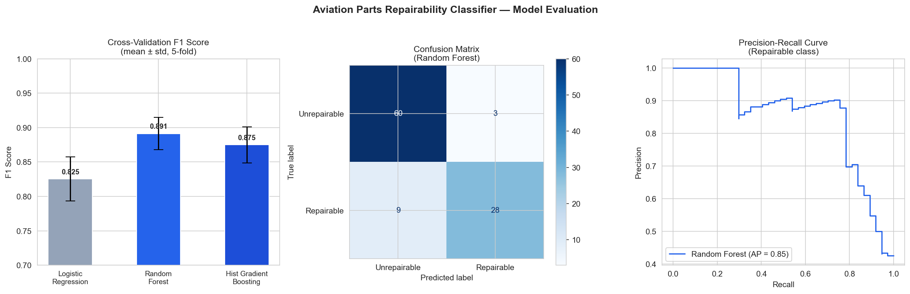

# Aviation Parts Repairability Classifier

A machine learning proof-of-concept that predicts whether an aircraft part should be classified as **repairable** or **unrepairable** based on its attributes — inspired by a manual classification task common in aviation MRO (Maintenance, Repair, and Overhaul) operations.

🚀 **[Live Demo → aviation-parts-classifier.streamlit.app](https://aviation-parts-classifier.streamlit.app/)**

> **Note:** This project uses 100% synthetic, randomly generated data. No real company data, part numbers, or proprietary information is used or represented anywhere in this repository.

---

## Why This Project

In aviation MRO operations, whether a part is repairable or treated as a one-time-use consumable is typically decided by the engineering department, based on factors like cost, manufacturer approval status, and material type. Once that decision is made, the resulting status is manually applied to each part in the system — often across long lists, one part at a time.

Working in that environment raised a natural question: if the underlying decision follows a consistent pattern, could that pattern be learned? This project is a proof-of-concept exploring exactly that — not to replace the decision-making process, but to test whether the criteria behind it are predictable from the part's attributes alone.

The labeling logic used here is grounded in real MRO industry practices: high-value, manufacturer-approved, non-tool components are more likely to be classified as repairable, while low-cost, unapproved, or tool items are more likely treated as consumables — consistent with standard rotable/repairable/consumable classification practices used across the industry.

---

## Dataset

500 synthetic aircraft parts were generated with the following attributes:

| Feature | Description |
|---|---|
| `material_type` | Standard Part (SP), Tool (T), Component (C), Raw Material (M), Non-aircraft (N) |
| `has_pma` | Whether the part has Parts Manufacturer Approval |
| `is_tool` | Whether the part is classified as a tool rather than an aircraft part |
| `is_fixed_asset` | Whether the part is tracked as a fixed asset |
| `ata_chapter` | Aircraft system classification code |
| `sales_price_sar` | Unit price in Saudi Riyals |
| `weight_kg` | Part weight in kilograms |

**Realistic noise was deliberately introduced** to avoid an artificially perfect dataset:
- 8% of labels were randomly flipped — simulating human classification inconsistency
- 5% of manufacturer-approval values were marked missing and then imputed — simulating incomplete real-world records

---

## Models & Results

Three models were trained and evaluated using **stratified 5-fold cross-validation**:

| Model | CV F1 (mean ± std) | CV Recall | Test Accuracy | Test F1 |
|---|---|---|---|---|
| Logistic Regression | 0.825 ± 0.032 | 0.833 | 77% | 0.774 |
| **Random Forest** | **0.891 ± 0.023** | **0.875** | **88%** | **0.877** |
| Hist Gradient Boosting | 0.875 ± 0.026 | 0.866 | 82% | 0.820 |

**Random Forest is the best model** — highest F1 and lowest standard deviation (±0.023), meaning it is both the most accurate and the most consistent across different data splits.

**Why Random Forest outperforms the others:** The classification logic contains conditional relationships — for example, a part being classified as a tool overrides its cost or approval status entirely. Tree-based models naturally capture this kind of conditional logic, while linear models assume more uniform relationships across features.

**Detailed performance — Random Forest (best model):**

| Class | Precision | Recall | F1-score | Support |
|---|---|---|---|---|
| Unrepairable | 0.87 | 0.95 | 0.91 | 63 |
| Repairable | 0.90 | 0.76 | 0.82 | 37 |

The model shows stronger recall for unrepairable parts (95%) than repairable ones (76%), reflecting class imbalance in the dataset — a common and realistic challenge in MRO data where consumable parts outnumber rotable ones.

---

## Technical Approach

**Preprocessing pipeline (scikit-learn Pipeline + ColumnTransformer):**
- `OneHotEncoder` for categorical features (`material_type`, `ata_chapter`) — avoids artificial numerical ordering that LabelEncoder would impose
- `passthrough` for numerical features — already in the correct format
- `class_weight='balanced'` — compensates for class imbalance without manual reweighting

**Evaluation:**
- Stratified 5-fold cross-validation — ensures each fold maintains the same class ratio
- F1-score as primary metric — more reliable than accuracy on imbalanced datasets
- Precision-Recall curve — shows the tradeoff between catching repairable parts and false alarms (Average Precision: 0.85)

---

## Visualizations



- **Left:** Cross-validation F1 scores with error bars showing consistency across folds
- **Centre:** Confusion matrix showing correct vs. incorrect predictions on the held-out test set
- **Right:** Precision-Recall curve for the repairable class (Average Precision = 0.85)

---

## Project Structure

```
aviation-parts-repairability-classifier/
├── aviation_classifier.ipynb   # Full notebook: data generation, training, evaluation
├── app.py                      # Streamlit web application
├── requirements.txt            # Python dependencies
├── model_evaluation.png        # Three-panel model evaluation chart
├── feature_importance.png      # Feature importance chart
├── confusion_matrix.png        # Confusion matrix
└── README.md
```

---

## Running the App Locally

```bash
git clone https://github.com/raghaddbae/aviation-parts-repairability-classifier.git
cd aviation-parts-repairability-classifier
pip install -r requirements.txt
streamlit run app.py
```

Or use the live demo directly: **[aviation-parts-classifier.streamlit.app](https://aviation-parts-classifier.streamlit.app/)**

---

## Future Extensions

- Extend from binary classification to the full material class taxonomy (Rotable / Repairable / Consumable)
- Add SHAP explanations for individual prediction interpretability
- Train on real (anonymized) MRO datasets where available
- Add business cost analysis: quantify the operational impact of each error type
- Redeploy on AWS as a production-grade service

---

## Author

Built by Raghad Baeshen — IT Specialist in aviation MRO, exploring how AI can support enterprise and operational decision-making.

[LinkedIn](https://www.linkedin.com/in/raghadbaeshen) · [Live Demo](https://aviation-parts-classifier.streamlit.app/) · [GitHub](https://github.com/raghaddbae/aviation-parts-repairability-classifier)
